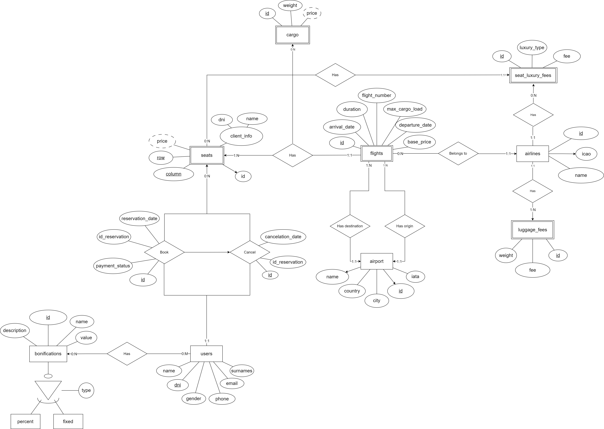
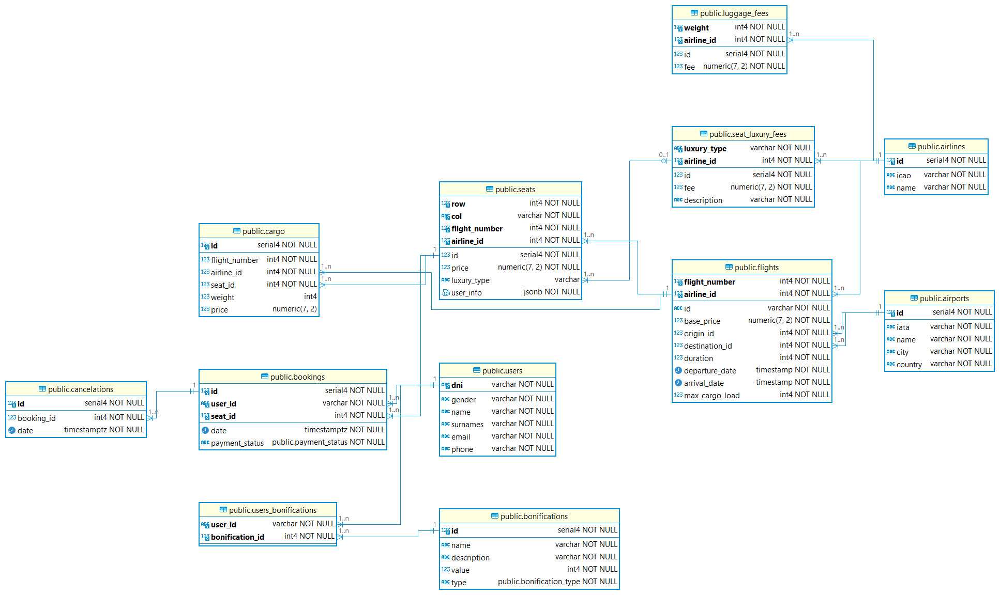

# Proyecto final de ADBD

Este proyecto ha sido desarrollado por:

- Alicia Guadalupe Cruz Pérez [alu0101420868@ull.edu.es](mailto:alu0101420868@ull.edu.es)
- Iván Texenery Díaz García [alu0101429762@ull.edu.es](mailto:alu0101429762@ull.edu.es)
- Javier Padilla Pío [alu0101410463@ull.edu.es](mailto:alu0101410463@ull.edu.es)

## Descripción

Se ha desarrollado una API REST que permite gestionar los distintos vuelos de un
sistema de reserva. Para ello se ha utilizado el framework
[Flask](https://flask.palletsprojects.com/en/3.0.x/) junto con
[PostgreSQL](https://www.postgresql.org/). Se podrán crear vuelos, agencias,
reservas y clientes. Además, se podrán realizar consultas sobre los vuelos
disponibles, las reservas realizadas y los clientes registrados.

### Entidades



### Diagrama de tablas



## Instalación

```bash
$ git clone git@github.com:javiipap/adbd-final.git
$ cd adbd-final
$ python3 -m venv env
$ source env/bin/activate
$ pip install -r requirements.txt

```

## Ejecución

```bash
$ ./init.sh
# También se puede ejecutar manualmente
$ source env/bin/activate
$ python main.py
```

## Contribuir

Cada vez que se instale una dependencia ejecutar el siguiente comando para actualizar el fichero `requirements.txt`:

```bash
$ pip freeze > requirements.txt
```
